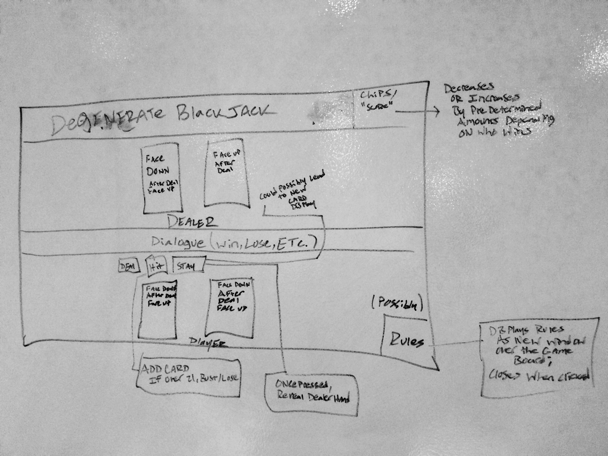

#Project One
================================

###Josh Fadem
-

-----------

###Degenerate Blackjack 
Blackjack, also known as twenty-one, is the most widely played casino banking game in the world.[1] Blackjack is a comparing card game between a player and dealer, meaning players compete against the dealer but not against other players. It is played with one or more decks of 52 cards. The object of the game is to beat the dealer in one of the following ways:

*Get 21 points on the player's first two cards (called a blackjack), without a dealer blackjack;
*Reach a final score higher than the dealer without exceeding 21; or
*Let the dealer draw additional cards until his or her hand exceeds 21.

My game will be a traditional blackjack game comprised of HTML, CSS, & JS/JQuery, IE Player vs. The house. It will have card graphics, with the Dealer's cards displayed on top of the dialogue box, and the player's cards displayed on the bottom of the dialogue box. There will be background music looping. 
There will be Three buttons marked as "Deal", "Hit Me", and "Stay/Hold". Once the "Deal" function is initiated, a randomization function will be initialized, which will choose the number and suite of your cards that are displayed, and the number and suite of the dealer cards (of which only one is displayed initially). The "Hit" button will add a card to your hand. If you go over 21, you will automatically "bust", or lose. If you do not, you will have the option of either clicking the "Hit" button again, or clicking the "Hold" button, which will initialize the Dealer card reveal/pickWinner function. The dealer will win all ties by default. I will not be including a feature that allows you to change the betting amount, to save me some time and sanity. If time permits, I will try to add this at the end. For now, your "score/chips" in the upper right hand corner will increase/decrease in a predetermined increment depending upon whether you win or lose. I will include a "Rules" button in the lower right hand corner for those that are not degenerate gamblers, and need a refresher on how to play. Once clicked, the "Rules" button will initialize a window that covers the main game area and displays the rules, and will disappear when clicked anywhere on said window. 
I will need several JS functions to accomplish this. There will need to be a turnChecker, a checkWinner, a deckShuffle/randomizer, a function to determine when Ace cards are considered to have the value of 11, and when they will have the value of one. I will need a function to change the dialogue in the dialogue box, and a function to change the "chips/score" dialogue box in the upper right hand corner. I'm anticipating a few loop functions, and migraines. Stylistically, I will utilize BootStrap & CSS to position stuff in my game window, which will have a background image. As far as the cards, I was able to figure out a codepen user's method for linking to indivudual images that he's hosting on his server, so I will be using that schema to save the time of me having to individually cut out each card from a vector sheet of playing cards (The cards also look really rad). When I am finished presenting this, I fully intend to violate GA's "No Hard Liquor On Campus" policy, and take a large swig of [Jameson](http://www.jamesonwhiskey.com/en/agegate). Oh, and I will attempt to follow the style guide, and be good about committing in Git/Pushing to my repo. 
